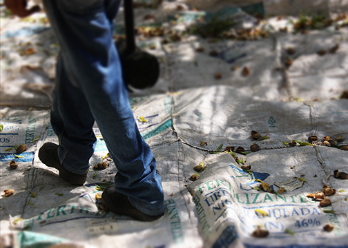

Chile 2014

Técnica: Fotografía digital. Fotodocumental. Serie de fotografías en color que retratan la cosecha de almendras en la VI región de la República de Chile.

En las fotografías se muestra el quehacer cotidiano de los cosechadores de almendra, una realidad que es reproducida en buena parte de la sexta región de Chile, y se retoman los momentos más significativos para representarlos como un día laboral. De esta forma, se establece un vínculo de conocimiento del espectador con las formas de vida de los trabajadores agrícolas teniendo como punto de cohesión la faena artesanal que sirven para reconocer paradigmas arraigados al concepto de Cosecha así como elementos de carácter económico, político, social y cultural relacionados con la misma.

