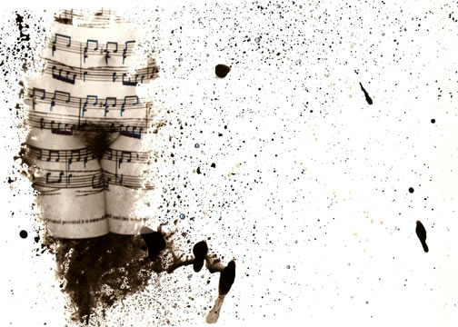

México 2005.

Técnica: plata sobre gelatina usando pinceles y cepillos de dientes para el revelado.

Tiene como objetivo abordar lo erótico del cuerpo femenino haciendo alusión al cosmos como universo complejo, total e infinito. Igual que el placer, representado en el cuerpo, no tiene límites y su belleza se vuelve sublime. Parte de este proyecto fue exhibido en 2010 en Coatepec, Xalapa, México como parte de la exposición &quot;Erotikón&quot;.

