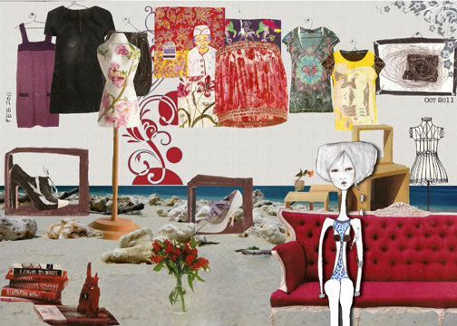
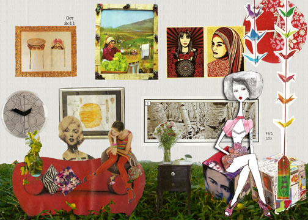
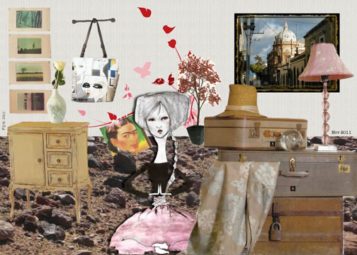

Chile - México 2011

Técnica: Collage.

Diseño exterior es un proyecto que reflexiona sobre la explotación exagerada de la Naturaleza por el ser humano. Con estética de revista de Diseño Interior, mezcla paisajes naturales que son usados como alfombra para acomodar diferentes objetos de la vida diaria. La intensión es retratar lo absurdo que llega a ser  la sobreexplotación natural. Se ha perdido el respeto por la naturaleza y olvidado que somos parte de ella. Se ve como un bien de consumo y no existe más armonía entre los seres humanos y su entorno.

