Chile - México 2010 - 2011

Técnica: Gráfica digital.

Mujer multifacética que se reinventa en diferentes cuerpos. <em>Ella</em> es un reflejo de lo femenino en sus diferentes facetas: Madre, hija, amante, puta, gorda, flaca, deforme, transgénero, etc. Fue expuesto en la ciudad de Santiago de Chile en Marzo de 2011.

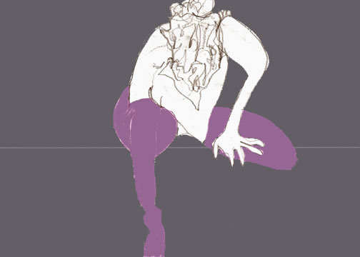
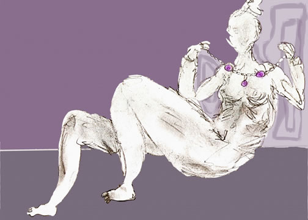
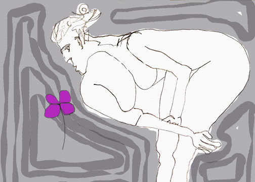
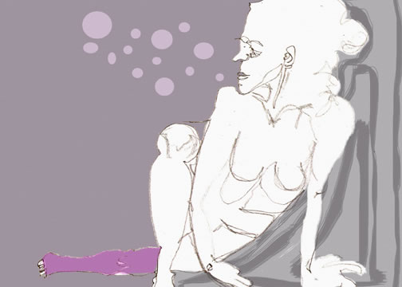

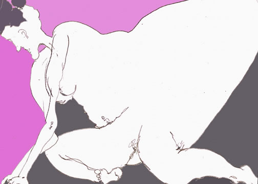

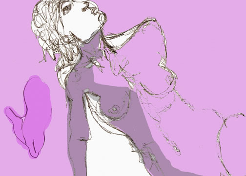

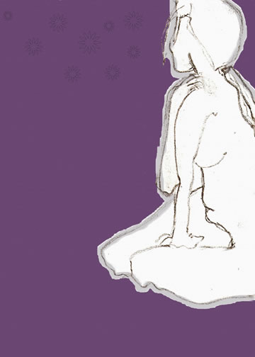
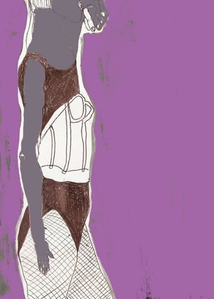
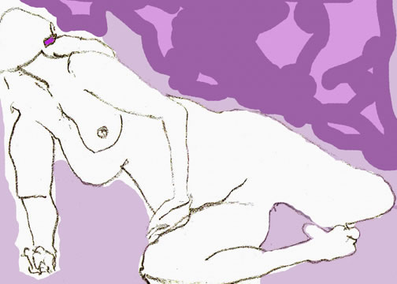
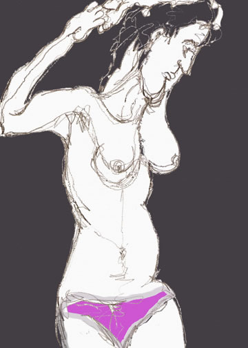
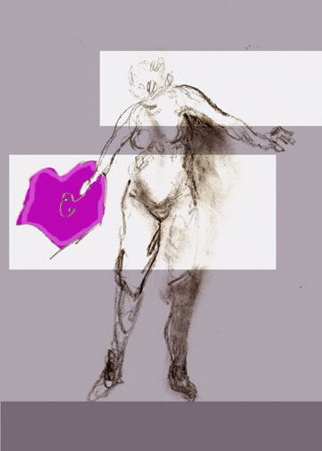

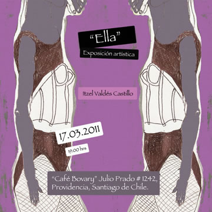
