Chile - México 2011 a la fecha

Técnica: Serie de fotografías retocadas digitalmente.

Homenaje a las mujeres que han marcado mi vida. Son retratos acomodados de manera cronológica, que expresan una parte de mi a través de los rostros de estás mujeres. Cada fotografía lleva el nombre de la mujer junto con la fecha en que nos conocimos.

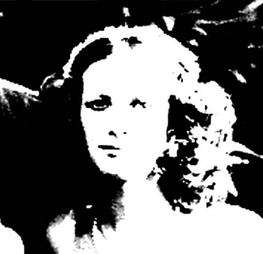
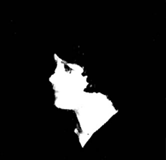

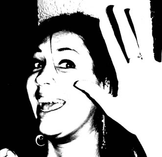
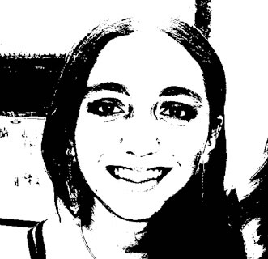

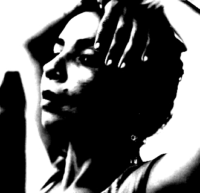

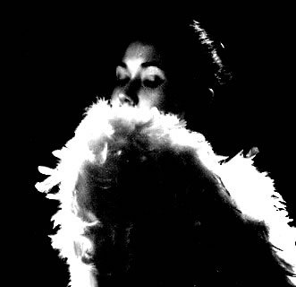
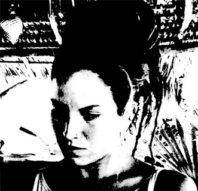
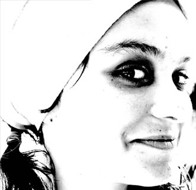

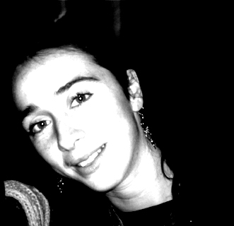
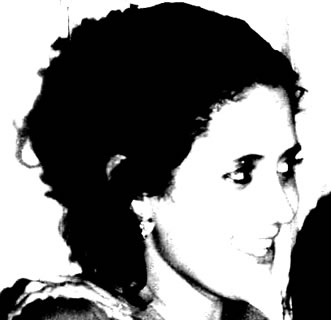
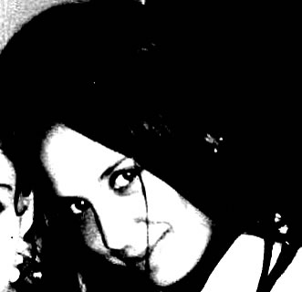
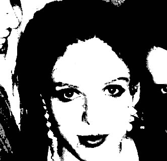
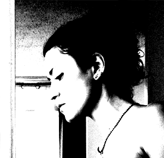

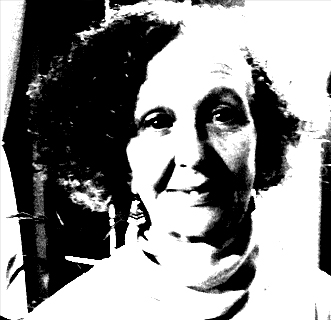
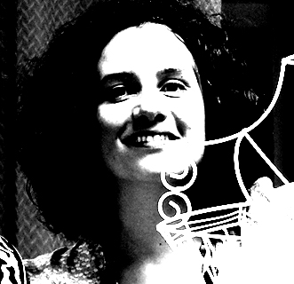
