Barcelona 2010. Citando el proyecto &ldquo;Post it, Ciudades ocasionales&rdquo; de <a href="http://www.martiperan.net/projects.php?id=21">Martí Perán</a>

Técnica: Registro fotográfico realizado a través de un teléfono móvil.

Por un lado pretende mostrar lo efímero de algunas intervenciones urbanas.  Las cortinillas de locales comerciales de la ciudad de Barcelona  son el fenómeno que aparece y desaparece constantemente del paisaje urbano, pero también; como el grafitti, es una intervención que corrompe el espacio público establecido, las normas dadas. Las cortinillas se revelan únicamente cuando la maquinaria de consumo descansa. Cuando el comercio se encuentra cerrado.  Así, se apropian de un espacio público que no está diseñado para que existan pero que al mismo tiempo les da vida.

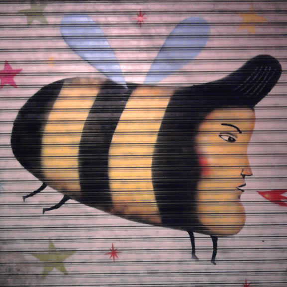
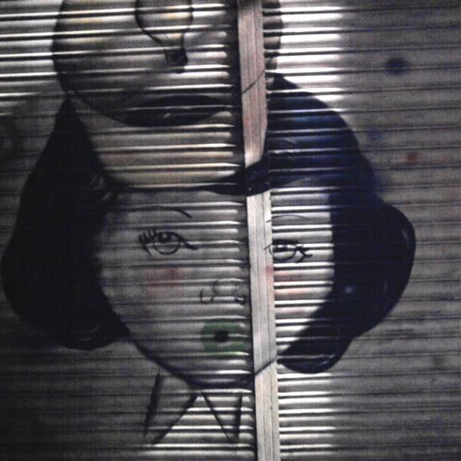
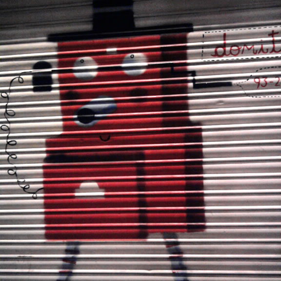
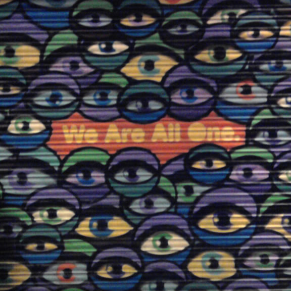
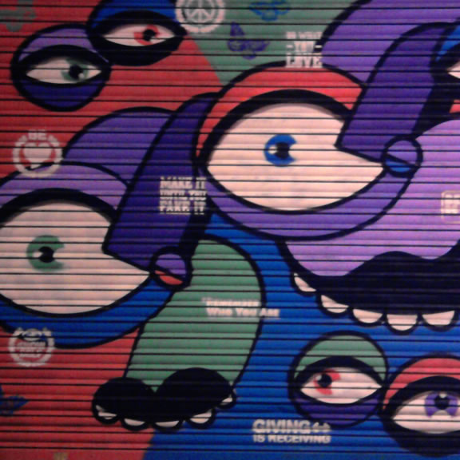
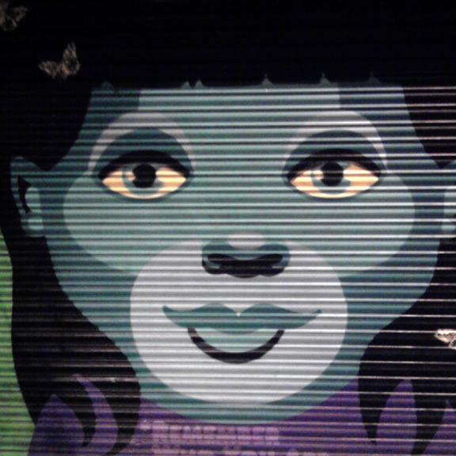
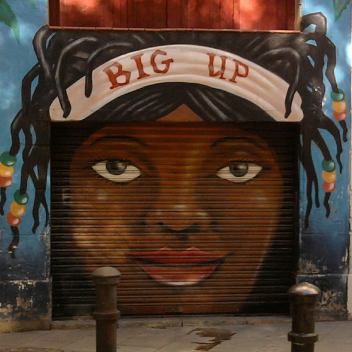
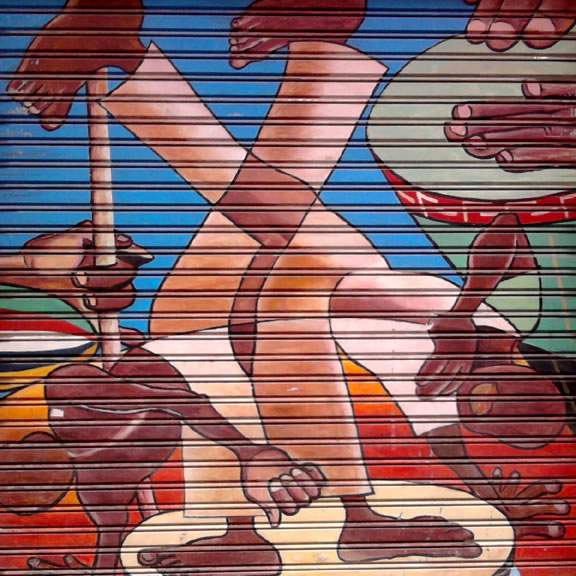
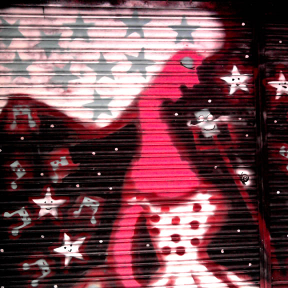
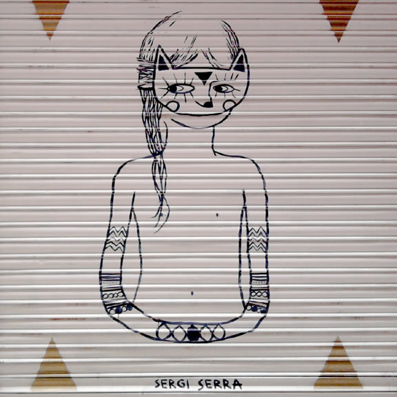
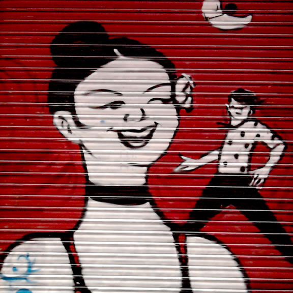

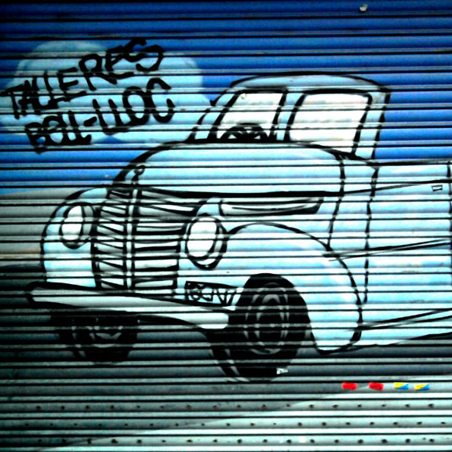
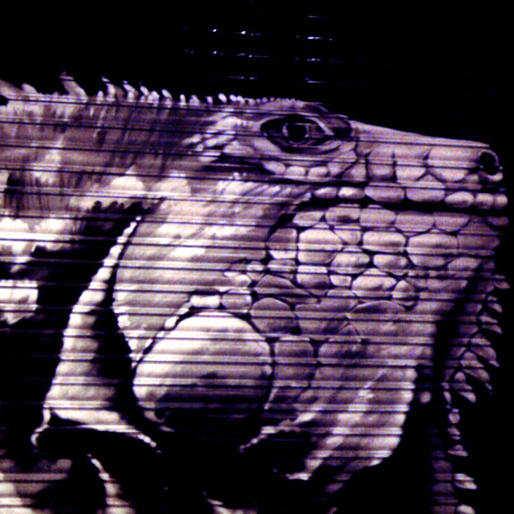
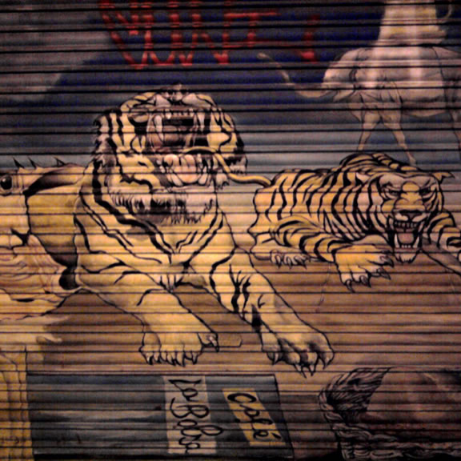
