Barcelona 2010.

Técnica: Fotografía análoga con la cámara Horizon 35mm panorámica de Lomography.

**La visión de una vencida** es mi ojo perdido. El de una mexicana que busca su razón de ser en el conquistador. La visión se rebela amarillenta, verde, vieja. Así es como recrea mi inconsciente al &ldquo;Viejo Mundo&rdquo;. Y en esa búsqueda de lo &ldquo;superior&rdquo;, la parodia de la realidad me escupe la cara. No veo nada extraordinario. Sólo gente normal, lugares y paisajes diferentes a los que estoy acostumbrada, como es de esperar.

La única razón que encuentro es que ellos ganaron y mi versión parece no tener eco.  Me equivoco, si hay un eco. En los murales de Diego Rivera, David Alfaro Siqueiros y Clemente Orozco; en los vestidos y diarios de Frida Kahlo y en **La visión de los vencidos**.

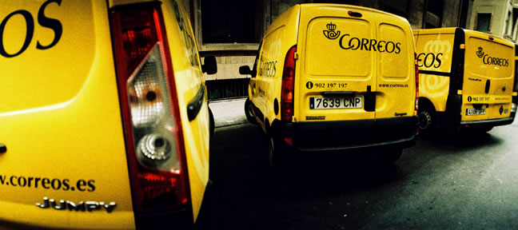
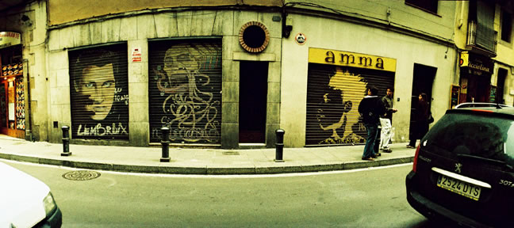
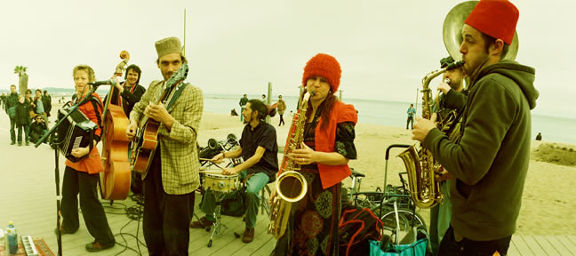
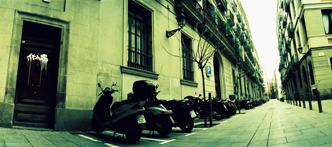
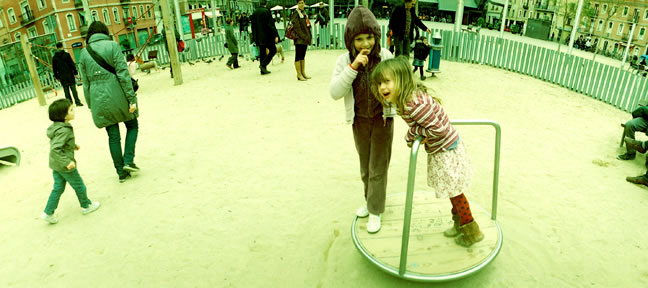
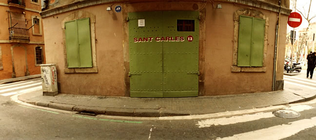
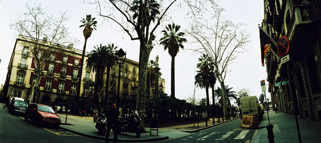
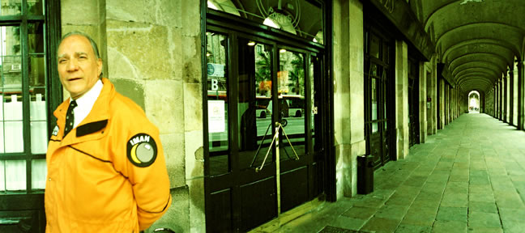
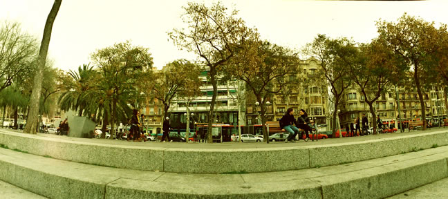
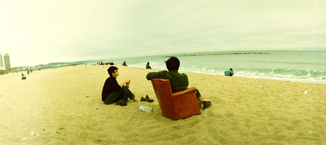
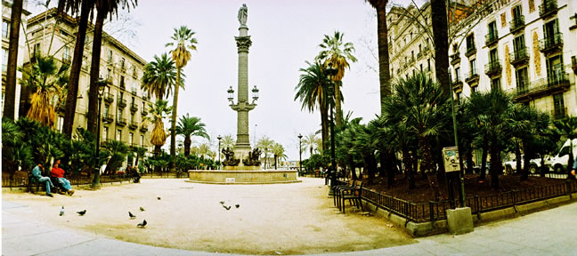
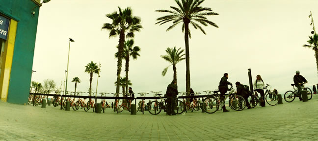
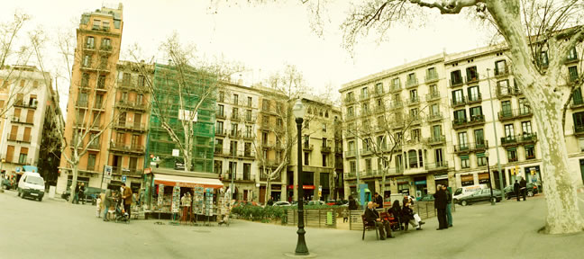
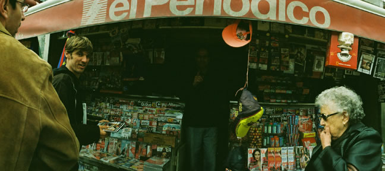
